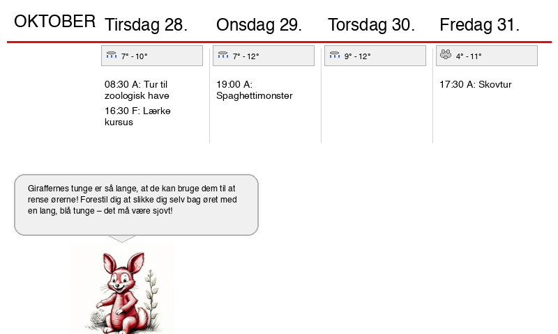

# ESP32 E-Ink Calendar Display

Tired of boring calendars? Meet the enchanted e-ink display! It's a battery-powered ESP32 wizard that conjures up your next four days of family adventures.

But here's where the real fun begins: Every morning, it transforms today's schedule into a tale, complete with a delightful fun fact and a charming Winnie-the-Pooh-style illustration of your daily escapades. Imagine: "Today we're off to the zoo!" accompanied by Pooh Bear playfully feeding a giraffe.

Designed to sprinkle a little extra joy into your kids' routines, it updates automatically and sips battery power like Pooh sips honey – lasting ages with deep sleep magic!



## Features

- 📅 Daily illustrated calendar with AI-generated themed artwork
- 🔋 Battery-powered with deep sleep (months of runtime)
- 🌐 Fetches calendar from server at midnight
- 📊 Displays multiple calendar events with color coding
- 🖼️ High-quality dithered images optimized for e-ink
- ⚡ Manual update via BOOT button
- 🔄 Automatic fallback checks every 3 hours

---

## Table of Contents

- [Hardware Requirements](#hardware-requirements)
- [Parts List & Where to Buy](#parts-list--where-to-buy)
- [Wiring Diagram](#wiring-diagram)
- [Server Setup](#server-setup)
- [ESP32 Setup](#esp32-setup)
- [Configuration](#configuration)
- [Usage](#usage)
- [Power Consumption](#power-consumption)
- [Troubleshooting](#troubleshooting)

---

## Hardware Requirements

### Required Components

1. **ESP32-S3 DevKit with PSRAM** (required for image processing)
2. **7.5" E-Ink Display** - Good Display DEPG0750BN (800x480, Black/White)
3. **LiPo Battery** - 3.7V, 2000-6000mAh
4. **PowerBoost 1000C** - 5V boost converter with charging circuit
5. **Micro USB cable** - For charging and programming

### Optional Components

- Enclosure/frame for the display
- USB power adapter for charging
- Jumper wires (if not soldering directly)

---

## Parts List & Where to Buy

| Component | Specifications | Where to Buy | Approx. Price |
|-----------|---------------|--------------|---------------|
| **ESP32-S3 DevKit** | ESP32-S3 with PSRAM (8MB+) | [AliExpress](https://www.aliexpress.com/w/wholesale-esp32%2525252ds3-psram.html), [DigiKey](https://www.digikey.com/en/products/detail/espressif-systems/ESP32-S3-DEVKITC-1-N8R8/16162693) | $5-15 |
| **DEPG0750BN Display** | 7.5" 800x480 E-Ink B/W | [Good Display](https://www.good-display.com/product/427.html), [Waveshare](https://www.waveshare.com/product/displays/e-paper/epaper-1/7.5inch-e-paper.htm), [AliExpress](https://www.aliexpress.com/w/wholesale-7.5-inch-e-paper.html) | $40-60 |
| **LiPo Battery** | 3.7V 3000-6000mAh JST connector | [Adafruit](https://www.adafruit.com/category/574), [Amazon](https://www.amazon.com/s?k=lipo+battery+3.7v+jst), [AliExpress](https://www.aliexpress.com/w/wholesale-3.7v-lipo-battery.html) | $10-20 |
| **PowerBoost 1000C** | 5V boost with LiPo charging | [Adafruit #2465](https://www.adafruit.com/product/2465), [Amazon](https://www.amazon.com/s?k=powerboost+1000c) | $15-20 |
| **Micro USB Cable** | For charging/programming | Any electronics store | $2-5 |

### Display Information

**Good Display DEPG0750BN** (Universal E-Paper Driver HAT compatible)
- **Resolution:** 800×480 pixels
- **Display Area:** 163.2 × 97.92mm
- **Dot Pitch:** 0.205 × 0.204mm
- **Colors:** Black and White (2-level grayscale)
- **Refresh Time:** ~16 seconds (full refresh)
- **Interface:** SPI (3-wire or 4-wire)
- **Viewing Angle:** >170°
- **Power Consumption:** 48mW refresh, <0.01µA sleep

### ESP32-S3 Requirements

**Critical:** Your ESP32-S3 **must have PSRAM**. Look for:
- ESP32-S3-DevKitC-1-**N8R8** (8MB Flash + 8MB PSRAM) ✅
- ESP32-S3 with PSRAM specification ✅
- Regular ESP32-S3-WROOM will **NOT work** for this project ❌

---

## Wiring Diagram

### E-Ink Display to ESP32-S3

```
┌──────────────────────┐         ┌─────────────────────┐
│  DEPG0750BN Display  │         │     ESP32-S3        │
│    (7.5" E-Ink)      │         │   (with PSRAM)      │
└──────────────────────┘         └─────────────────────┘
         │                                 │
    BUSY ├─────────────────────────────────┤ GPIO 4
     RST ├─────────────────────────────────┤ GPIO 16
      DC ├─────────────────────────────────┤ GPIO 17
      CS ├─────────────────────────────────┤ GPIO 10
 CLK/SCK ├─────────────────────────────────┤ GPIO 18
DIN/MOSI ├─────────────────────────────────┤ GPIO 23
     VCC ├─────────────────────────────────┤ 3V3
     GND ├─────────────────────────────────┤ GND
```

### Power Circuit

```
┌───────────┐       ┌──────────────┐       ┌──────────────┐
│  LiPo     │       │ PowerBoost   │       │  ESP32-S3    │
│  Battery  │───────│   1000C      │───────│              │
│  3.7V     │  BAT  │              │  5V   │   VIN/5V     │
└───────────┘       │              │       │              │
                    │  GND   ─────────────  GND          │
     USB ───────────│  USB         │       └──────────────┘
   (Charging)       └──────────────┘
```

### Pin Summary Table

| Display Pin | Function | ESP32-S3 GPIO | Notes |
|-------------|----------|---------------|-------|
| BUSY | Busy status | GPIO 4 | |
| RST | Reset | GPIO 16 | Active low |
| DC | Data/Command | GPIO 17 | High=data, Low=command |
| CS | Chip Select | GPIO 10 | Active low |
| CLK | SPI Clock | GPIO 18 | SPI SCK |
| DIN | SPI Data In | GPIO 23 | SPI MOSI |
| VCC | Power 3.3V | 3V3 | Display power |
| GND | Ground | GND | Common ground |

**Additional Power Control:**
- **GPIO 21**: Display power control (optional, controls power to display)

**Manual Update:**
- **GPIO 0 (BOOT button)**: Press during wake to force update

---

## Server Setup

The server generates the calendar image and serves it to the ESP32 over HTTP.

### Prerequisites

- Python 3.8+
- Docker & Docker Compose (recommended)
- Google Calendar API credentials
- Image generation API key (OpenRouter or similar)

### Quick Start with Docker

1. **Clone or create your project structure:**

```
calendar-server/
├── docker-compose.yml
├── Dockerfile
├── requirements.txt
├── web_server.py
├── generate_illustrated_calendar.py
├── .env
├── credentials/
│   └── kalender.json
└── output/
```

2. **Configure environment variables** (`.env`):

```bash
# Google Calendar
CALENDAR_1_ID=your-email@gmail.com
CALENDAR_1_SYMBOL=P
CALENDAR_1_NAME=Personal

# Optional: Second calendar
CALENDAR_2_ID=calendar-id@group.calendar.google.com
CALENDAR_2_SYMBOL=■
CALENDAR_2_NAME=Family

# API Keys
OPENROUTER_API_KEY=your-api-key-here
IMAGEROUTER_API_KEY=your-image-api-key-here

# Google Credentials
GOOGLE_CREDENTIALS_PATH=credentials/kalender.json
```

3. **Setup Google Calendar API:**

   - Go to [Google Cloud Console](https://console.cloud.google.com/)
   - Create a new project
   - Enable Google Calendar API
   - Create a Service Account
   - Download credentials JSON as `credentials/kalender.json`
   - Share your calendar with the service account email

4. **Build and run:**

```bash
# Build the Docker container
docker-compose build

# Start the server
docker-compose up -d

# Check status
curl http://localhost:8000/status
```

### Server Endpoints

The server exposes these endpoints:

- **`GET /calendar.png`** - Main calendar image for ESP32
- **`GET /info`** - JSON with calendar status and last update time
- **`GET /status`** - Detailed server status
- **`GET /refresh`** - Manually trigger calendar regeneration
- **`GET /`** - Web interface for debugging

### Example `/info` Response

```json
{
  "calendar_available": true,
  "calendar_url": "/calendar.png",
  "last_update": "2025-10-26T06:00:00.123456"
}
```

### Automatic Updates

The server automatically regenerates the calendar at **midnight (00:00)** every day with:
- Fresh calendar events from Google Calendar
- New AI-generated illustration
- Updated date and layout

### Manual Server Setup (Without Docker)

If you prefer to run without Docker:

```bash
# Install dependencies
pip install -r requirements.txt

# Run the server
python web_server.py
```

The server will run on `http://0.0.0.0:8000`

---

## ESP32 Setup

### Software Requirements

- **Arduino IDE** 2.0+
- ESP32 board support
- Required libraries

### Arduino IDE Setup

1. **Install ESP32 Board Support:**
   - Open Arduino IDE
   - Go to File → Preferences
   - Add to "Additional Board Manager URLs":
     ```
     https://raw.githubusercontent.com/espressif/arduino-esp32/gh-pages/package_esp32_index.json
     ```
   - Go to Tools → Board → Boards Manager
   - Search for "esp32" and install "esp32 by Espressif Systems"

2. **Install Required Libraries:**
   
   Go to Tools → Manage Libraries and install:
   - **GxEPD2** by Jean-Marc Zingg (version 1.5.0+)
   - **ArduinoJson** by Benoit Blanchon (version 7.0+)

3. **Select Your Board:**
   - Tools → Board → ESP32 Arduino → "ESP32-S3 Dev Module"
   - Tools → PSRAM → "OPI PSRAM" (or "Enabled")
   - Tools → Flash Size → "8MB" or larger
   - Tools → Partition Scheme → "Huge APP (3MB No OTA/1MB SPIFFS)"

### ESP32 Code

The ESP32 code (Arduino sketch) should include:

**Key Features:**
- WiFi connection
- HTTP client for fetching calendar
- E-ink display driver (GxEPD2)
- Deep sleep management
- Manual update via BOOT button
- Time synchronization (NTP)
- Retry logic and error handling

**Configuration in Code:**

```cpp
// WiFi Configuration
const char* WIFI_SSID = "Your-WiFi-Name";
const char* WIFI_PASSWORD = "Your-WiFi-Password";

// Server Configuration
const char* SERVER_URL = "http://<YOUR IP>>:8000";  // Your server IP

// Timezone (adjust for your location)
const char* TIMEZONE = "CET-1CEST,M3.5.0,M10.5.0/3";  // Central European Time

// Update interval for backup checks
const int BACKUP_CHECK_HOURS = 3;  // Check every 3 hours if midnight update failed
```

### Upload to ESP32

1. Connect ESP32 via USB
2. Select the correct COM port in Tools → Port
3. Click Upload
4. Monitor via Tools → Serial Monitor (115200 baud)

### First Boot

On first boot, the ESP32 will:
1. Connect to WiFi
2. Sync time via NTP
3. Fetch calendar from server
4. Display the image on e-ink
5. Enter deep sleep until midnight

---

## Configuration

### Server Configuration

Edit `.env` file:

```bash
# Multiple calendars
CALENDAR_1_ID=personal@gmail.com
CALENDAR_1_SYMBOL=P
CALENDAR_1_NAME=Personal

CALENDAR_2_ID=work@example.com
CALENDAR_2_SYMBOL=W
CALENDAR_2_NAME=Work

# Image generation
OPENROUTER_API_KEY=sk-or-v1-...
IMAGE_MODEL=flux/dev

# Display settings (optional)
DISPLAY_WIDTH=800
DISPLAY_HEIGHT=480
```

### ESP32 Configuration

In the Arduino sketch, adjust:

```cpp
// Sleep/Update Schedule
const int BACKUP_CHECK_HOURS = 3;        // Backup check interval
const int MIDNIGHT_WINDOW_START = 23;   // Start checking at 23:30
const int MIDNIGHT_WINDOW_END = 2;      // Stop checking at 02:00

// Display pins (if different)
const int PIN_CS   = 10;
const int PIN_DC   = 13;
const int PIN_RST  = 14;
const int PIN_PWR  = 21;  // Optional power control
```

---

## Usage

### Normal Operation

1. **Power on**: Connect battery or USB power
2. **First boot**: ESP32 will fetch and display calendar
3. **Automatic updates**: Display updates at midnight automatically
4. **Deep sleep**: Device sleeps between updates to save battery

### Manual Update

Press the **BOOT button** (GPIO 0) on the ESP32 board:
- If device is sleeping, it will wake and check for updates
- If already awake, next boot will force an update

### Charging

Connect USB to the PowerBoost 1000C:
- LED indicates charging status
- Device continues to operate while charging
- Can take 2-4 hours depending on battery size

### Monitoring

View serial output (115200 baud) for debugging:

```
=== ESP32-S3 Calendar Display Starting ===
Boot #1
PSRAM OK: 8388608 bytes, Free: 8126464 bytes
Connecting to WiFi...
WiFi connected! IP: 192.168.0.211
Time synced: Sun Oct 26 10:30:00 2025
Server info: {"calendar_available":true,...}
Fetching calendar image...
Image size: 65432 bytes
BMP validation successful
Display updated successfully!
Sleeping until midnight...
Entering deep sleep...
```

---

## Power Consumption

### Estimated Battery Life

| Battery Capacity | Updates/Day | Estimated Runtime |
|------------------|-------------|-------------------|
| 2000 mAh | 1 (midnight) | ~3-4 months |
| 3000 mAh | 1 (midnight) | ~5-6 months |
| 6000 mAh | 1 (midnight) | ~10-12 months |

With backup checks every 3 hours: reduce estimates by ~20%

### Power Profile

- **Deep Sleep**: <1mA
- **WiFi Active**: ~80-120mA
- **Display Update**: ~40-60mA
- **Active Time**: ~30-45 seconds per update

### Optimization Tips

- Increase `BACKUP_CHECK_HOURS` to 6 or 12 for longer battery life
- Use larger battery (6000mAh) for near-yearly runtime
- Disable debug serial output in production
- Use display power control (GPIO 21) to fully cut power

---

## Troubleshooting

### ESP32 Issues

**Problem: "PSRAM not found!"**
- Solution: You must use ESP32-S3 with PSRAM. Check board specifications.

**Problem: Display shows nothing**
- Check wiring connections
- Verify display power (3.3V)
- Try manual refresh: press BOOT button
- Check serial monitor for errors

**Problem: WiFi won't connect**
- Verify SSID and password in code
- Check WiFi signal strength
- Try 2.4GHz network only (ESP32 doesn't support 5GHz)

**Problem: "Failed to allocate memory"**
- PSRAM is required for image buffer
- Check PSRAM is enabled in board settings
- Reduce image size on server if needed

**Problem: Display updates but image is corrupted**
- Server image might be wrong format (needs BMP)
- Check image dimensions match display (800x480)
- Verify server is generating valid BMP files

### Server Issues

**Problem: Server won't start**
- Check Docker is running: `docker ps`
- View logs: `docker-compose logs`
- Verify `.env` file has all required values

**Problem: Calendar not updating at midnight**
- Check server logs: `docker-compose logs calendar-server`
- Verify timezone settings in server
- Manually trigger: `curl http://localhost:8000/refresh`

**Problem: Google Calendar events not showing**
- Verify service account has calendar access
- Check credentials file path
- Ensure calendar is shared with service account email

**Problem: ESP32 gets error fetching image**
- Verify server IP is correct
- Check firewall/network settings
- Test from browser: `http://your-server-ip:8000/calendar.png`
- Check server logs for errors

### Display Issues

**Problem: Image looks wrong (incorrect colors)**
- E-ink displays require dithered 1-bit images
- Server must generate black/white only
- Check dithering algorithm (Floyd-Steinberg recommended)

**Problem: Ghosting on display**
- Perform full refresh occasionally
- Adjust display waveform settings
- Some ghosting is normal for e-ink

**Problem: Display slow to update**
- Normal for e-ink (~16 seconds)
- Check for blocking operations during refresh
- Ensure adequate power supply

### Debugging Tools

**Serial Monitor:**
```cpp
Serial.println("Debug message");
Serial.printf("Value: %d\n", value);
```

**Test Server Manually:**
```bash
# Check server status
curl http://<YOUR IP>:8000/status

# Check calendar availability
curl http://<YOUR IP>:8000/info

# Download image
curl http://<YOUR IP>:8000/calendar.png -o test.png
```

**Check PSRAM:**
```cpp
if (psramFound()) {
  Serial.printf("PSRAM: %d bytes\n", ESP.getPsramSize());
  Serial.printf("Free PSRAM: %d bytes\n", ESP.getFreePsram());
}
```

---

## Future Improvements

### Planned Features (Not in Current Version)

- [ ] Battery level monitoring
  - Voltage divider on ADC pin
  - Display battery icon
  - Low battery warning
- [ ] Weather widget
- [ ] Touch screen interaction
- [ ] OTA (Over-The-Air) updates
- [ ] Multiple display layouts
- [ ] Configurable themes

### Battery Monitoring Implementation

To add battery monitoring in a future version:

**Hardware:**
```
Battery+ ──→ 100kΩ ──→ GPIO 1 (ADC) ──→ 100kΩ ──→ GND
```

**Code:**
```cpp
#define BATTERY_PIN 1
float batteryVoltage = (analogRead(BATTERY_PIN) / 4095.0) * 2 * 3.3 * 1.1;
uint8_t batteryPercent = ((batteryVoltage - 3.0) / (4.2 - 3.0)) * 100;
```

---

## License

This project is open source. Feel free to modify and share!

## Credits

- **E-ink display library:** GxEPD2 by Jean-Marc Zingg
- **Display:** Good Display DEPG0750BN
- **Platform:** Espressif ESP32-S3

## Contributing

Contributions welcome! Feel free to:
- Open issues for bugs
- Submit pull requests
- Share your modifications
- Suggest improvements

---

## Support

For issues and questions:
- Check the [Troubleshooting](#troubleshooting) section
- Review serial monitor output
- Check server logs
- Open a GitHub issue with:
  - Serial monitor output
  - Server logs
  - Photos of your setup

---

**Happy calendar displaying! 📅✨**
